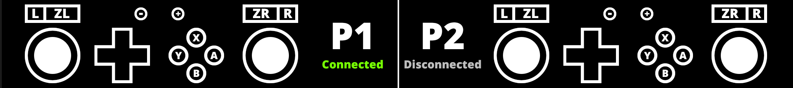

# Periscope Viewer

This is an alternative viewer to the one provided by the upstream
[periscope project](https://codeberg.org/periwinkle/periscope). Notable
differences include:

- Show connection status. (requires [fork of the sysmodule](https://github.com/M1cha/periscope))
- Can Render shapes and text so you don't have to create separate images for
  every button.
- Very powerful toml config which allows you to render any state with if-conditions.
- Easier multi-controller support by using "layouts" that can be selected for a
  certain controller.

## Screenshot

